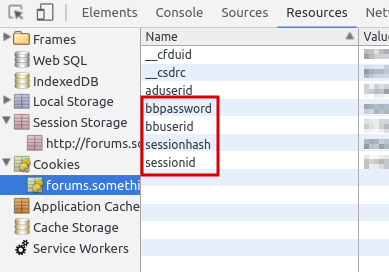
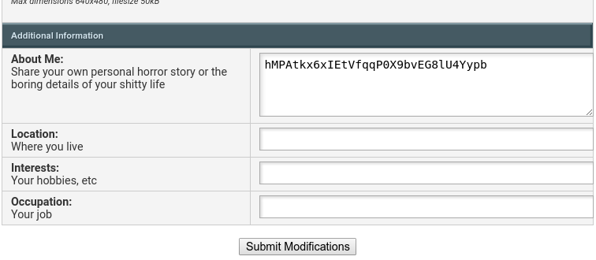

# GoonAuth2

GoonAuth2 is a REST API service that can be used to authorize membership in the Something Is Awful internet forum.

## Requirements

- Pipenv
- Python3 (3.4+)
- Redis (v2.8.4)

## Installation

Install dependencies via the included **Pipfile**:

	pipenv install

There are a couple of values you'll need to update before the server will work. First, update `REDIS_HOST`, `REDIS_PORT`, and `REDIS_DB_NUM` to point to whatever Redis server you want to use. The only things stored in the database are short-lived `key:value` pairs that automatically expire in `HASH_LIFESPAN_MINS * 60` seconds.

You'll also want to set values for the following strings: `COOKIE_SESSIONID`, `COOKIE_SESSIONHASH`, `COOKIE_BBUSERID`, and `COOKIE_BBPASSWORD`. I opted to create an accompanying `local_settings.py` file and define them within that, but feel free to specify them as you wish.

These four values need to be taken from an existing logged-in user's cookies:

Once everything is in place, you can start the server using `gunicorn`:

	gunicorn server:app

## Usage

### 1. Generate a validation hash

POST to `/v1/generate_hash/` with a JSON-encoded payload containing a `username` value equal to the user's username.

The returned payload will contain a `hash` key with a random 32-character alphanumeric value:

	{
		"hash": "hMPAtkx6xIEtVfqqP0X9bvEG8lU4Yypb"
	}

The hash will expire after **5 minutes** but can easily be re-generated after expiration by re-submitting the above request.

### 2. Update the user's profile with the hash

Direct the user to save the above hash to a publicly-viewable section of their profile:

Wherever they save it, it needs to be visible when they navigate to `http://forums.somethingisawful.com/member.php?action=getinfo&username=<USERNAME_HERE>`.

### 3. Validate the user

Once the hash is in-place, POST a request to `/v1/validate_user/` with a JSON-encoded payload containing a `username` value equal to the user's username.

The returned payload will contain a `validated` key with a `boolean` value of whether or not the hash was detected :

	{
		"validated": true
	}
